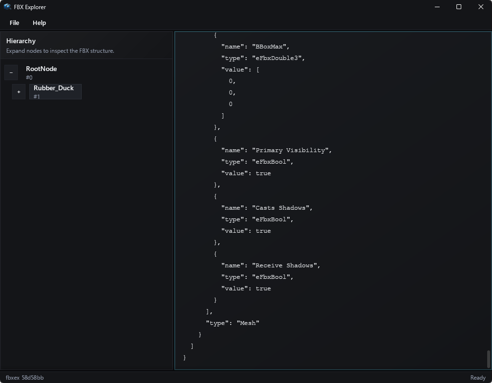

# fbxex - The FBX Explorer & Inspector

A lightweight Windows desktop application for exploring and inspecting FBX files.

## Highlights

- Open FBX files from the app menu and load the scene into an in-memory node map.
- Browse the node hierarchy in a tree view with expand/collapse and load status.
- Select a node to see its properties and attributes serialized to JSON.

## How it works

- Runtime loads the FBX scene in memory via the FBX SDK and eagerly builds a node index.
- Properties and attributes of each node are serialized into JSON and bridged to the UI layer.
